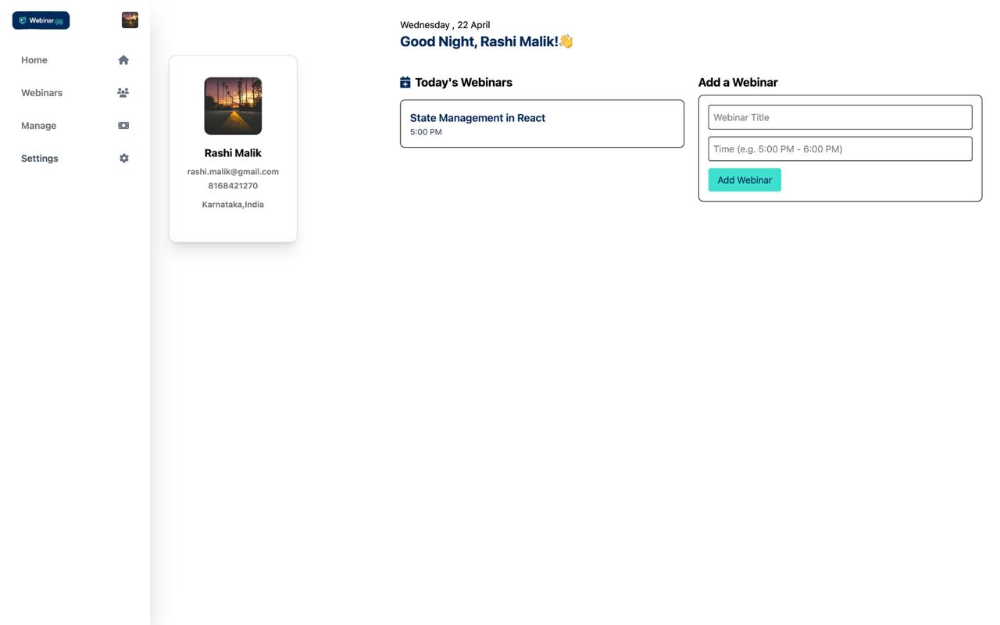
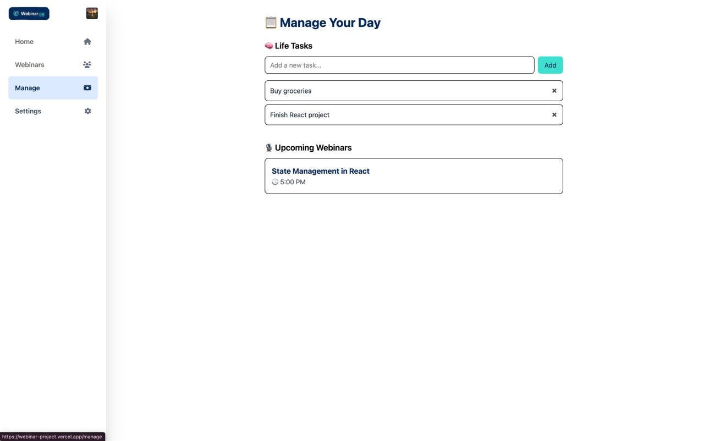
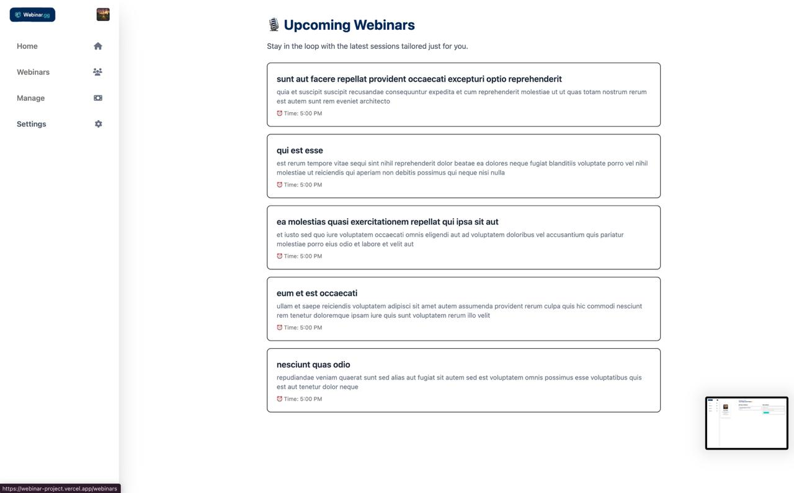
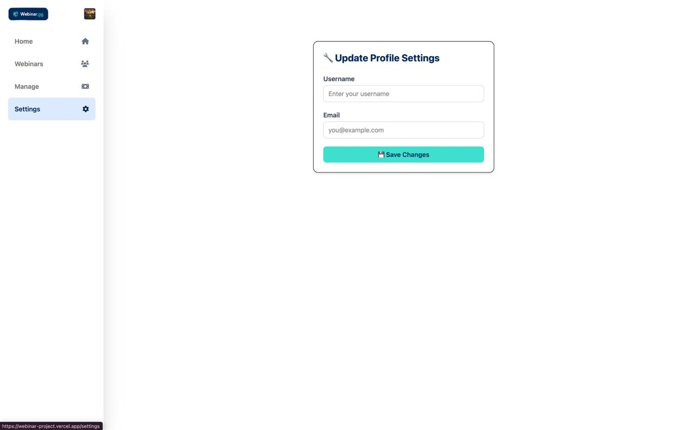

# Webinar Management App

Welcome to the Webinar Management App! This is a simple app that helps you manage webinars and tasks. You can add webinars, view them, and even manage your daily tasks all in one place. Plus, there’s a profile page where you can update your information.

## Features

- **Home Page**: 
  - See a list of today's webinars.
  - Add a new webinar with a title and time.
  - View your profile information.

- **Webinars Page**: 
  - See a list of upcoming webinars (these are fetched from an API).
  
- **Manage Page**: 
  - Add, mark tasks as done, and delete them.
  - View all tasks you've added.
  - See upcoming webinars.

- **Settings Page**: 
  - Update your username and email.
  - See a success message when your profile is updated.

- **Sidebar**: 
  - Easily navigate between different pages (Home, Webinars, Manage, Settings).
  - Responsive layout that works on both mobile and desktop.

## Technologies Used

- **React**: The app is built using React for building the user interface.
- **Tailwind CSS**: For fast and easy styling.
- **Font Awesome**: For adding icons to the app.
- **React Router**: To handle navigation between pages.
- **Context API**: For managing the webinar data across different pages.

## 📸 Screenshots

### 🏠 Home

### 📅 Manage

### ⏳ Webinars

### 🧩 Settings
